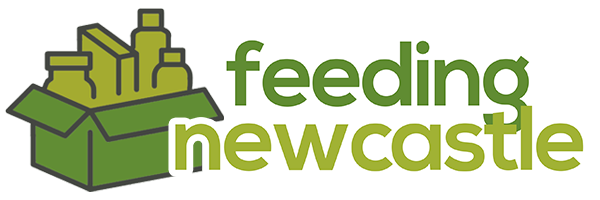

# Feeding Newcastle
  
> Project for CSC2033 Team 15,
> Git Repo [_here_](https://github.com/sclay-ncl/CSC2033-Food-Bank-Project).


## Table of Contents
* [General Info](#general-information)
* [Important Info](#important-information-)
* [Project Authors](#project-authors)
* [Technologies Used](#technologies-used)
* [Libraries Used](#libraries-used)
* [Application Pages](#application-pages)
* [References](#references)
* [Setup](#setup)
* [Usage](#usage)


## General Information
This project's aim is to help with the UN's second sustainable goal of zero hunger. 
The project is a flask based web application aimed to aid all who utilise food banks;
For both people in need and wanting to help and food bank managers and volunteers

## Important Information ❗

The PayPal Donation button is **live** any donation made will go through to Feeding Newcastle's PayPal account.
If you would like to see the donation link working in full please watch the demonstration video.

## Project Authors
- Anthony Clermont
- Sol Clay
- Tess Goulandris
- Nate Hartley
- Alli Edwards


## Technologies Used
- [Python - version 3.8](https://www.python.org/)
- [Flask - version 2.0](https://flask.palletsprojects.com/en/2.0.x/)
- [SQL Alchemy - version 2.5.1](https://www.sqlalchemy.org/)
- [Mapbox API](https://www.mapbox.com/)
- [Open Street Maps](https://wiki.openstreetmap.org/wiki/API)
- [Google Re-Captcha](https://www.google.com/recaptcha/about/)


## Libraries Used
- [click](https://click.palletsprojects.com/en/8.0.x/)
- [Flask](https://flask.palletsprojects.com/en/2.0.x/)
- [ItsDangerous](https://itsdangerous.palletsprojects.com/en/2.0.x/)
- [Jinja2](https://jinja.palletsprojects.com/en/3.0.x/)
- [MarkupSafe](https://pypi.org/project/MarkupSafe/)
- [pip](https://pypi.org/project/pip/)
- [setuptools](https://pypi.org/project/setuptools/)
- [Werkzeug](https://pypi.org/project/Werkzeug/)
- [wheel](https://pypi.org/project/wheel/)
- [Flask-SQLAlchemy](https://flask-sqlalchemy.palletsprojects.com/en/2.x/)
- [SshTunnel](https://pypi.org/project/sshtunnel/)
- [Requests](https://docs.python-requests.org/en/latest/)
- [Flask-Login](https://flask-login.readthedocs.io/en/latest/)
- [Flask_wtf](https://flask-wtf.readthedocs.io/en/1.0.x/)
- [WTForms](https://wtforms.readthedocs.io/en/3.0.x/)
- [Uk-postcode-utils](https://pypi.org/project/uk-postcode-utils/)
- [Rfeed](https://pypi.org/project/rfeed/)
- [Email-validator](https://pypi.org/project/email-validator/)


## Application Pages
- [Register](./templates/register.html)
  - Error Validation
  - Hashing Functionality
- [Login](./templates/login.html)
  - Error Validation
  - Checking Hashing Functionality 
  - Email Password Reset Functionality
- [Food Bank Search](./templates/food-bank-search.html)
  - Mapbox Api Usage to Display Key Data
  - Multi-Location Support
  - Automatic Closest Food Bank (Logged In Only)
- [Food Bank Information](./templates/food-bank-information.html)
  - Detailed Information Provided
  - Food Bank Category Stock Levels
- [Food Bank Information (Logged-In)](./templates/food-bank-information.html)
  - Detailed Information Provided
  - Food Bank Category Stock Levels
  - Save/Un-Save food banks
- [Contact](./templates/contact-us.html)
  - Useful Information
- [Donate](./templates/donate.html)
  - Paypal Donation link 
- [Profile](./templates/profile.html)
  - View/Edit Profile 
- [Admin Dashboard](./templates/admin.html)
  - Overview of Key Application Data
  - View/Delete Error Logs
- Food Bank User
  - [Add New Locations](./templates/food-bank-add-address.html)
  - [Add/Remove Opening Times](./templates/food-bank-add-opening-hours.html)
  - [View/Edit Food Bank Contact Information](./templates/food-bank-information.html)
  - [Manual or Automatic Stock Boundaries](./templates/manage-stock.html)
  - [Stock Management](./templates/manage-stock.html)

## Setup

#### Clone the repository
```git clone https://github.com/sclay-ncl/CSC2033-Food-Bank-Project.git```

#### Local Environment
Create a virtual environment:  
1. Open a Terminal
2. Change directory into project directory: ``` cd ProjectLocation ```
3. Create the virtualenv: ``` virtualenv -p python3 myenv ```
4. Activate the environment: ``` source myenv/bin/activate ```

#### Project Dependencies
To install the project's dependencies, run the following command:  
``` pip install -r requirements.txt ```

#### Interpreter Configuration
If using an interpreter to run the project, please ensure your configuration is working in the current directory.  
For more information about how to do this please visit your IDE's Documentation:
- [PyCharm](https://www.jetbrains.com/pycharm/learn/)
- [Visual Studio Code](https://code.visualstudio.com/docs)
- [Sublime Text](https://www.sublimetext.com/docs/)
- [Eclipse](https://www.eclipse.org/documentation/)

## Usage
#### Set up the database connection
In [app.py](./app.py) line 14, set the [database URI](https://flask-sqlalchemy.palletsprojects.com/en/2.x/config/), 
both SQLite and MariaDB have been tested and work with the program.

#### Populate the database the sample data
The user passwords in the sample data are **insecure**, do not use in deployment.
Open a terminal, change directory to the project directory if not already.   
Run the following command: ``` python test/populate_db.py ```

#### Start the Server and Run Application:

Open a terminal, change directory to the project directory if not already.   
Run the following command: ``` python app.py ```

#### Test User Accounts
Account type: Email, Password  
Admin: TestAdmin@email.com, password  
User: TestUser@email.com, password  
Food Bank: TestFoodBank@foodbank.com, password  


## References
This image has been used in the [index](./templates/index.html) page.  
  
Credits of this image: https://bonnydowns.org/foodbank/

